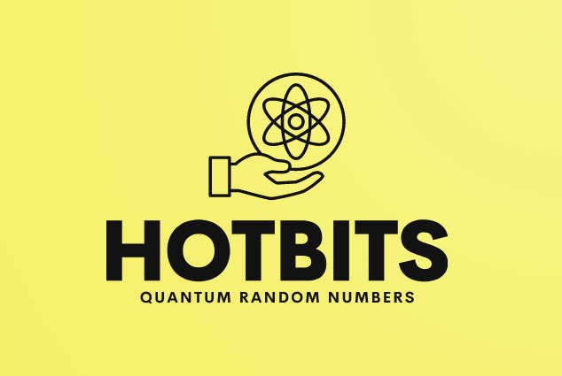
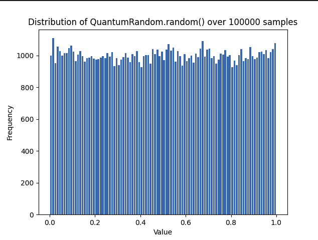

# HotBits: Quantum Random Number Generator



HotBits is a quantum random number generator that harnesses the power of quantum mechanics to produce truly random numbers. Unlike conventional pseudo-random number generators, HotBits captures data from a physical process - the fluctuations of webcam pixels due to quantum noise.


**Usage**

Clone the repository:

```bash
git clone <repository_link>
```

Navigate to the HotBits directory and install the necessary requirements:

```bash
cd HotBits
pip3 install -r requirements.txt
```

Run the HotBits generator:
```bash
python3 capture_hotbits.py
```
For generating quantum random numbers using the stored HotBits:

```python
from quantum_random import QuantumRandom

qr = QuantumRandom()
random_num = qr.randint(1, 100)  # This will give you a random number between 1 and 100.
```


## How It Works
### Camera HotBits Generation

The primary source of randomness in this implementation comes from the quantum phenomena that occur in the camera sensor when capturing frames. Every pixel in an image can capture photons, and this interaction, at its core, is inherently quantum.

The camera captures frames, and each pixel's least significant bit is extracted and considered for randomness. The subtle variations in each pixel, caused by quantum phenomena, result in a source of randomness.

### `PixelProcessor`

The `PixelProcessor` class is designed to process frames from a webcam and extract random bits from them. For each frame, a subset of pixels is randomly sampled. For each sampled pixel, the least significant bit of its RGB values is extracted. The rationale behind using the least significant bit is that it is the most susceptible to quantum noise, and thus, provides a good source of randomness.

### QuantumRandom: Using HotBits

The `QuantumRandom` class serves as the main interface for generating quantum random numbers. It does so by consuming pre-generated quantum random bits (HotBits) that are stored in JSON files.

### Loading and Using HotBits

HotBits are stored in the specified directory as JSON files. Each JSON file contains a list of integers, which are binary representations of the quantum random bits. Upon initializing a QuantumRandom object, it will load one of these files randomly.

As random bits are used up, the QuantumRandom class will automatically load the next available file, ensuring a continuous supply of randomness. To guarantee that the same randomness isn't used twice, once a HotBits file is loaded and its contents are consumed, it is deleted.
QuantumRandom Methods

The methods provided by QuantumRandom mimic the standard Python random library's functions but source their randomness from the quantum bits. Functions like randint, choice, shuffle, and others operate similarly to their counterparts in the Python random library, but they use quantum-generated bits to ensure true randomness.
Maintaining Quantum Indeterminacy

The quantum indeterminacy is maintained by ensuring that once the quantum bits (HotBits) are generated and stored, they are not observed or used until they are needed for generating random numbers. In quantum mechanics, the act of observing a quantum state collapses it. Therefore, reading and using a HotBits file simulates this "observation," rendering the quantum bits deterministic thereafter.

# Warning!

Opening and observing the contents of a HotBits file before it is used by the QuantumRandom class effectively collapses its quantum state, rendering it deterministic and defeating the purpose of using quantum-generated randomness. Always let the QuantumRandom class handle HotBits files to ensure the indeterminacy of the quantum bits.

*By adhering to these principles and methods, this implementation ensures a source of randomness rooted in quantum mechanics, one of the most fundamentally random processes known to science.*

## Use Cases

- Cryptography: Use quantum randomness for generating cryptographic keys and nonces.
- Gaming: Improve randomness in games for fairer outcomes.
- Scientific Simulations: Achieve accurate randomness in  Monte Carlo simulations.
- Lotteries: Ensure unbiased and unpredictable draws.

## HotBits Cache & Settings

The generated HotBits are stored in JSON files within the hotbits_storage directory. Each file contains a list of integers derived from the captured quantum bits.

Settings:
- `--interval`: Interval between frame captures in seconds (default is 0.0001).
- `--storage`: Directory to store generated HotBits (default is hotbits_storage).
- `--max_sets`: Maximum number of sets (files) of hotbits to be generated.
- `--verbose`: Enable verbose output for debugging purposes.


## For Developers

If you're looking to contribute or modify the codebase:

- `capture_hotbits.py`: This is the main file that initializes the webcam, captures frames, and processes pixels to generate and store HotBits.
- `pixel_processor.py`: This class processes the webcam frames to generate random bits.
- `hotbit_storage.py`: Handles the storage and management of HotBits.
- `webcam_capture.py`: Manages the webcam functionalities including initialization, frame capture, and resource release.
- `quantum_random.py`: Mimics the Python random library but uses the stored quantum-generated bits.


## Testing:

There's a testing script test_quantum_random.py that provides rigorous tests for each of the QuantumRandom methods and generates histograms to showcase the distribution of generated numbers.




## Further Reading & Resources
1. Quantum Mechanics and Randomness
2. Understanding True Randomness
3. HotBits: An External Service for Quantum Random Number Generation

## License

This project is licensed under the MIT License.

Contributors

  - [Keith](https://www.github.com/keithorange)

## Acknowledgements

Special thanks to:
  - OpenAI community for providing valuable feedback and insights.
  - github.com/isuretpolos for inspiring the camera-hotbits idea.

## FAQs

*1. Why use quantum randomness over traditional pseudo-random number generators?*

Quantum randomness harnesses the inherent uncertainty of quantum mechanics, making it truly unpredictable. Traditional pseudo-random number generators are deterministic and can be predicted given their initial state.

*2. How often should I regenerate HotBits?*

The frequency of regeneration depends on your application's demand for random numbers. Once all stored HotBits are consumed, you'd need to regenerate.

*3. Can I use this in commercial applications?*

Yes, but always ensure that the randomness meets the standards and requirements of your specific application.

## Troubleshooting & Support

`Error: "No HotBits available. Generate more quantum random bits."`
**Solution**: This means the cache of HotBits is empty. You need to run the HotBits generator to produce more.

`Error accessing the webcam:`

**Possible Solutions**:
Ensure no other application is using the webcam.
Check if the webcam is properly connected.
Update or reinstall webcam drivers.


**For further assistance, raise an issue on the GitHub repository or contact the maintainers.**

## Contributing
We welcome contributions from the community. If you're looking to contribute:

1. Fork the repository.
2. Create a new branch for your features or bug fixes.
3. Commit your changes with meaningful commit messages.
4. Open a pull request and provide a detailed description of your changes.

*All contributions are subject to review by the maintainers.*

## Future Enhancements
- Integrate with other sources of quantum randomness.
- Optimize the storage and retrieval of HotBits.
- Provide a cloud API for on-demand quantum random numbers.


## Thank you for your interest in HotBits. We hope you find it useful and look forward to seeing the innovative applications you come up with using true quantum randomness!

